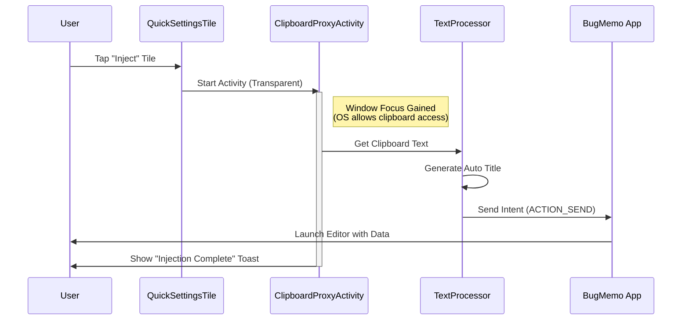

# 💉 Injector: The Quick Capture Satellite

> **"Inject Knowledge into the Core."**

メインアプリ **BugMemo** のエコシステムを拡張する、クリップボード転送専用のサテライト・ユーティリティ。

思考を止めずに情報をデータベースへ「注入 (Inject)」するための最速ワークフローを提供します。

## 🚀 概要 (Overview)

Injector は、ブラウジングや開発作業中に遭遇した重要なテキスト（エラーログ、コードスニペット、知見）を、アプリを開くことなくワンタップで BugMemo へ転送するためのツールです。

「Android 10 以降のバックグラウンドからのクリップボードアクセス制限」という技術的課題を、**透明な Activity (Transparent Proxy Activity)** というアプローチで解決し、セキュリティと利便性を両立しています。

## ✨ 主な機能 (Features)

### ⚡ Quick Settings Tile Integration

#### Zero-Click Launch

- Android のクイック設定パネル（通知シェード）に常駐する専用タイルを提供
- どの画面を開いていても、スワイプ＆タップだけでクリップボードの内容を吸い上げ、BugMemo へ転送します

#### Stealth UX

転送処理は一瞬で完了し、成功時には「💉 Injection Complete」というトースト通知のみを表示。作業のフローを阻害しません。

### 🔗 Share Target

#### Intent Receiver

- ブラウザや SNS アプリの「共有」メニューに Injector として表示
- `ACTION_SEND` (text/plain) を受け取り、自動的に加工して転送します

### 🧠 Intelligent Processing

#### Auto Titling

- 転送されたテキストの冒頭を解析し、BugMemo 側で保存する際の「タイトル」を自動生成。整理の手間を省きます
- (Architecture ready for future AI summarization)

## 🛠️ 技術スタック (Tech Stack)

### Core Technology

#### OS Integration

- **TileService**: クイック設定パネルのライフサイクル管理
- **ClipboardManager**: システムクリップボードへのセキュアなアクセス
- **Intent (Deep Link)**: `com.example.bugmemo`パッケージへの明示的なデータ送信

### Architecture

#### Pattern

- MVVM + Clean Architecture (Domain / UI / Service 層の分離)
- **Hilt**による依存性注入（Service や Activity への DI）

#### UI

- Jetpack Compose (Material 3)
- **Transparent Activity**: `Theme.Translucent.NoTitleBar`を適用した Activity を一瞬だけ起動し、フォアグラウンド判定を得てからクリップボードにアクセスするハック技法

### Workflow Diagram

## 💻 セットアップ & 使い方

### 1. インストール

ビルドして実機にインストールします。

> **注意**: 転送先の **BugMemo** アプリがインストールされている必要があります。

### 2. タイルの配置

1. ステータスバーを下にスワイプしてクイック設定パネルを開く
2. 「編集（鉛筆アイコン）」をタップ
3. 「Inject to BugMemo」タイルを見つけ、使いやすい位置にドラッグ＆ドロップ

### 3. 実行 (Injection)

1. 任意のアプリでテキストをコピー
2. クイック設定パネルのタイルをタップ
3. **Done!** 自動的に BugMemo のエディタが立ち上がります

## 📂 プロジェクト構成

- **service/**: `InjectorTileService` (バックグラウンドエントリーポイント)
- **ui/proxy/**: `ClipboardProxyActivity` (透明な中継役)
- **domain/**: `TextProcessor` (テキスト加工ロジック)
- **core/**: `ClipboardHelper` (OS API ラッパー)
- **di/**: Hilt Modules

---

_Injector - The Quick Capture Satellite for BugMemo Ecosystem_
